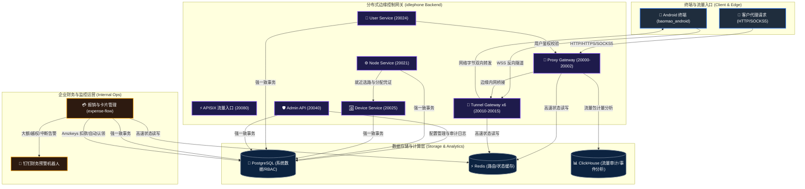

# 
 baoma-inc

  <strong>分布式网络共享代理与闲置设备云端控制基础设施研发中心</strong>

  
  
  
  
  
  
  
  

---

## 🌌 组织定位

欢迎来到 **baoma-inc**（宝马研发中心）的私有开发者空间。我们专注于构建安全、高并发、分布式的边缘网络代理技术和企业级自动化运营系统。

我们的核心业务围绕 **闲置 Android 设备池反向代理共享方案** 展开，并辅以高度自研的**企业内部财务审批与自动化监控系统**，实现资产最大化利用与合规性管控 of 闭环。

---

## 🛠 核心技术版图

我们目前主要维护三大相互协同的核心项目，分别覆盖**客户端**、**分布式后端**和**内部管理台**：

| 项目 / 仓库 | 语言 & 技术栈 | 职责 & 定位 | 阶段与状态 |
| :--- | :--- | :--- | :--- |
| [**baomao_android**](https://github.com/baoma-inc/baomao_android) | `Kotlin`, `Gradle`, `XML Views`, `Foreground Service` | 终端网络共享客户端。设备启动前台常驻服务，通过 TLS/WSS 长连接反向接入网关，实现设备带宽的安全出站代理。 | `MVP 0A` (技术骨架验证与本地 mock 闭环) |
| [**idlephone**](https://github.com/baoma-inc/idlephone) | `Go`, `GORM`, `Redis`, `ClickHouse`, `APISIX`, `Protobuf` | 分布式边缘代理后端。包含就近调度（node-svc）、隧道接入（tunnel-gateway x6）、代理入口（proxy-gateway）及管理员 RBAC（admin-api），支撑十万级在线隧道。 | `Active Development` (高并发隧道核心基线) |
| [**expense-flow**](https://github.com/baoma-inc/expense-flow) | `TypeScript`, `Next.js`, `Drizzle ORM`, `Cloudflare Access/Tunnel/R2` | 企业内部报销与财务管理系统。集成员工报销审批、Amzkeys 虚拟卡管理、OKX 实时汇率对账及钉钉财务机器人多维度预警。 | `Production` (部署于 `bx.taichang.app`) |

---

## 📐 系统全局架构

各项目以 **`idlephone` (Go 平台后端)** 为中枢进行分布式路由协同，由 **`baomao_android` (Kotlin 客户端)** 提供边缘出口节点，并使用 **`expense-flow` (Next.js 服务端)** 提供整体运营财务保障与钉钉自动化安全风控。

---

## 🔒 研发安全与规范

由于本组织的所有项目均服务于私有商业基础设施及公司内部财务流，请所有研发成员严格遵守以下安全基线：

1. **凭证隔离**：
   - 严禁将任何明文密码、API Keys（如 OKX API、Amzkeys 密钥、R2 Credentials） or 敏感的 Access 凭证硬编码提交至仓库。
   - 本地开发统一从 `.env.example` 复制并维护个人本地 `.env`。
2. **分支流水线**：
   - `main` 和 `production` 分支受到强保护，严禁强推（`force push`）。
   - 所有变更必须经过 Pull Request，且需通过对应的 CI 门禁（Linting、Typecheck、单元测试、Playwright E2E/Go race test）。
3. **部署准则**：
   - 生产环境统一监听在本地 Loopback（`127.0.0.1`），由宿主机防火墙阻断外部直连，一切流量经由 APISIX / Cloudflare Tunnel 安全接入。

---

## 📖 快速上手通道

如果您是新加入的团队成员，请按照以下路径配置您的本地开发机：

- **Android 客户端开发**：克隆 [baomao_android](https://github.com/baoma-inc/baomao_android)，使用 Android Studio 打开，选择 `mockDebug` 变体进行一键运行与 Mock 测试。
- **分布式后端开发**：克隆 [idlephone](https://github.com/baoma-inc/idlephone)，确保本地安装了 Docker，使用 `./deploy.sh` 快速拉起本地基础依赖（PostgreSQL/Redis/ClickHouse），并通过 Go 命令行调测服务。
- **财务与运营工具开发**：克隆 [expense-flow](https://github.com/baoma-inc/expense-flow)，使用 `pnpm install` 安装依赖，配置本地 `.env` 或执行 `pnpm dev:local` 使用内嵌式 PGlite 极速启动开发环境。

---

  🔒 <strong>BAOMA-INC Confidential - Internal Use Only</strong>

