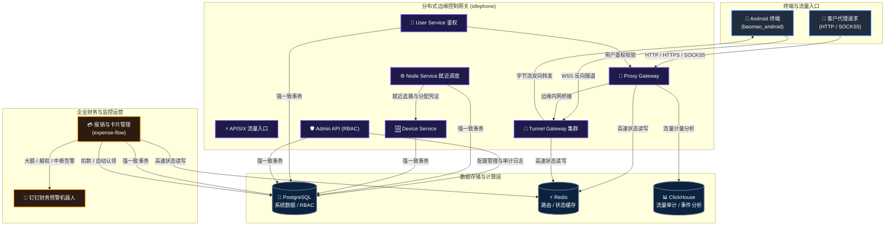

<div align="center">


<br><br>

<a href="https://github.com/baoma-inc">
  
</a>

<br>

<!-- STATS:BADGES:START -->


<!-- STATS:BADGES:END -->

<br>


</div>

---

## 🌌 关于我们

欢迎来到 **baoma-inc（宝马研发中心）** —— 一个专注于**分布式边缘网络与自动化运营基础设施**的工程团队。

我们的核心方向：

- 🛰️ **闲置设备云端化**：让闲置 Android 设备变身为安全可控的边缘网络节点；
- ⚡ **高并发隧道网关**：Go 语言打造的分布式反向隧道与就近调度体系，目标十万级在线连接；
- 🤖 **自动化运营闭环**：TypeScript / Next.js 构建的企业级财务审批、对账与实时风控预警系统。

> 从终端到网关，从数据到风控 —— 我们用代码把每一台闲置设备变成基础设施的一部分。

---

## 🚀 核心项目

| 项目 | 技术栈 | 职责与定位 | 状态 |
| :--- | :--- | :--- | :--- |
| 📱 [**baomao_android**](https://github.com/baoma-inc/baomao_android) | `Kotlin` `Gradle` `Foreground Service` | 终端网络共享客户端，通过 TLS/WSS 长连接反向接入网关，实现设备带宽的安全出站代理 | `MVP` 骨架验证 |
| 🛰️ [**idlephone**](https://github.com/baoma-inc/idlephone) | `Go` `Redis` `ClickHouse` `APISIX` `Protobuf` | 分布式边缘代理后端：就近调度、隧道接入、代理入口与管理员 RBAC，支撑十万级在线隧道 | `Active` 高速迭代 |
| 💳 [**expense-flow**](https://github.com/baoma-inc/expense-flow) | `TypeScript` `Next.js` `Drizzle` `Cloudflare` | 企业内部报销与财务管理系统：审批流、虚拟卡管理、实时汇率对账与钉钉机器人预警 | `Production` 生产运行 |

---

## 📐 系统全局架构

三大项目以 **idlephone（Go 后端）** 为中枢协同：**baomao_android** 提供边缘出口节点，**expense-flow** 保障运营财务与自动化风控。



---

## 🧬 语言基因图谱

> 基于组织内全部仓库的真实代码字节数统计，每日自动刷新。

<!-- LANGS:START -->
```text
Kotlin      ████████████░░░░░░░░░░░░░░░░  42.3%  1.7 MB
TypeScript  ███████████░░░░░░░░░░░░░░░░░  40.8%  1.6 MB
Go          ████░░░░░░░░░░░░░░░░░░░░░░░░  15.0%  601.0 KB
Shell       █░░░░░░░░░░░░░░░░░░░░░░░░░░░   1.1%  42.9 KB
PLpgSQL     █░░░░░░░░░░░░░░░░░░░░░░░░░░░   0.6%  22.4 KB
JavaScript  █░░░░░░░░░░░░░░░░░░░░░░░░░░░   0.2%  6.3 KB
Dockerfile  █░░░░░░░░░░░░░░░░░░░░░░░░░░░   0.1%  2.9 KB
CSS         █░░░░░░░░░░░░░░░░░░░░░░░░░░░   0.0%  1.4 KB
Other       █░░░░░░░░░░░░░░░░░░░░░░░░░░░   0.0%  1.3 KB
```
<!-- LANGS:END -->

---

## 🏆 贡献者排行榜

> 汇总组织所有仓库的提交贡献（已过滤机器人），每日自动刷新。

<div align="center">

<!-- LEADERBOARD:START -->
<table>
  <tr align="center"><th>排名</th><th>贡献者</th><th>Commits</th><th>火力值</th><th>占比</th></tr>
  <tr align="center"><td><b>🥇</b></td><td><a href="https://github.com/Birditch"><br><b>Birditch</b></a></td><td><b>71</b></td><td><code>██████████████</code></td><td>54.2%</td></tr>
  <tr align="center"><td><b>🥈</b></td><td><a href="https://github.com/backspace135"><br><b>backspace135</b></a></td><td><b>51</b></td><td><code>██████████░░░░</code></td><td>38.9%</td></tr>
  <tr align="center"><td><b>🥉</b></td><td><a href="https://github.com/Night-stars-1"><br><b>Night-stars-1</b></a></td><td><b>8</b></td><td><code>██░░░░░░░░░░░░</code></td><td>6.1%</td></tr>
  <tr align="center"><td><b>#4</b></td><td><a href="https://github.com/yuhang-jieke"><br><b>yuhang-jieke</b></a></td><td><b>1</b></td><td><code>█░░░░░░░░░░░░░</code></td><td>0.8%</td></tr>
</table>
<!-- LEADERBOARD:END -->

</div>

---

## 👥 团队成员

<div align="center">

<!-- MEMBERS:START -->
<p>
  <a href="https://github.com/backspace135" title="backspace135"></a>
  <a href="https://github.com/Birditch" title="Birditch"></a>
  <a href="https://github.com/Night-stars-1" title="Night-stars-1"></a>
  <a href="https://github.com/yun12370" title="yun12370"></a>
</p>
<b>4</b> 位工程师 · 一台闲置设备都不放过
<!-- MEMBERS:END -->

</div>

---

## 🐍 代码贡献动态

<div align="center">

<picture>
  <source media="(prefers-color-scheme: dark)" srcset="https://raw.githubusercontent.com/baoma-inc/.github/output/github-snake-dark.svg">
  <source media="(prefers-color-scheme: light)" srcset="https://raw.githubusercontent.com/baoma-inc/.github/output/github-snake.svg">
  
</picture>

</div>

---

## 🔒 安全与合规

- 🔐 所有仓库禁止提交任何明文凭证，敏感配置一律走环境变量与密钥管理；
- 🛡️ `main` / `production` 分支受保护，所有变更经 Pull Request + CI 门禁（Lint / Typecheck / 单测 / E2E / race test）合入；
- 🌐 生产服务默认仅监听本地回环，流量统一经网关安全接入。

---

<div align="center">

**⭐ 用代码把每一台闲置设备变成基础设施 ⭐**


</div>
