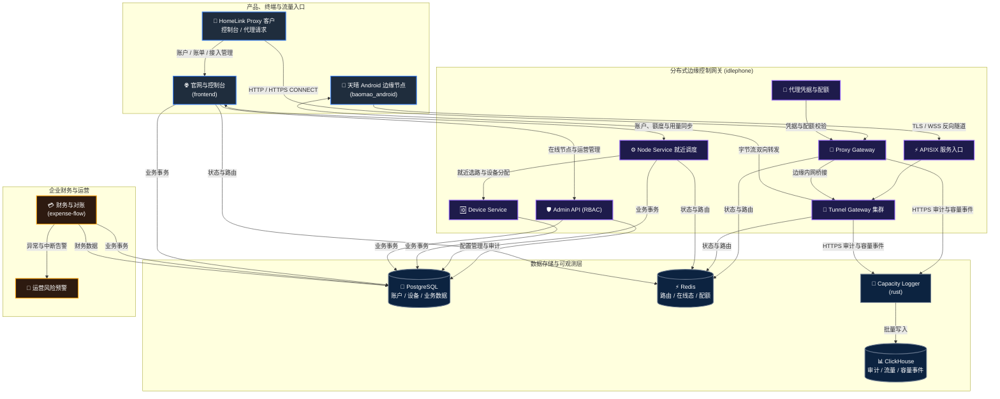

<div align="center">


<br><br>

<a href="https://github.com/baoma-inc">
  
</a>

<br>

<!-- STATS:BADGES:START -->


<!-- STATS:BADGES:END -->

<br>


</div>

---

## 🌌 关于我们

欢迎来到 **baoma-inc（宝马研发中心）** —— 一个围绕 **HomeLink Proxy** 构建移动代理产品与分布式边缘基础设施的工程团队。

我们的核心方向：

- 📱 **授权设备网络化**：将用户授权的 Android 设备接入安全可控的移动网络节点池；
- 🌐 **移动代理产品化**：用统一的官网、客户控制台与运营后台承载账户、接入、用量和服务流程；
- ⚡ **分布式流量调度**：以 Go 构建反向隧道、就近调度与高并发代理网关；
- 📊 **可观测运营闭环**：通过 Rust、ClickHouse 与自动化运营系统连接审计、容量分析、财务和风控。

> 从用户授权的终端到客户可用的代理服务，我们让设备、流量、数据与运营形成可靠闭环。

---

## 🚀 核心项目

| 项目 | 技术栈 | 职责与定位 | 状态 |
| :--- | :--- | :--- | :--- |
| 📱 [**天晴（baomao_android）**](https://github.com/baoma-inc/baomao_android) | `Kotlin` `Gradle` `Foreground Service` | 用户授权的 Android 边缘节点客户端，以出站 TLS/WSS 长连接接入网关，在设备侧完成安全流量转发 | `MVP 1` 真实后端对接 |
| 🛰️ [**idlephone**](https://github.com/baoma-inc/idlephone) | `Go` `PostgreSQL` `Redis` `ClickHouse` `APISIX` | 移动代理控制平面与分布式网关：负责设备接入、就近调度、代理鉴权、反向隧道和流量计量 | `Active` 持续迭代 |
| 🌐 [**frontend**](https://github.com/baoma-inc/frontend) | `TypeScript` `Next.js` `React` `PostgreSQL` `Redis` | HomeLink Proxy 官网、客户控制台与运营后台，承载账户、接入凭据、用量、账单和服务流程 | `Active` 产品建设 |
| 🦀 [**rust**](https://github.com/baoma-inc/rust) | `Rust` `Axum` `Tokio` `ClickHouse` | 独立的 HTTPS 审计日志与容量事件接收服务，为网关提供有界队列写入和可观测数据入口 | `Active` 独立演进 |
| 💳 [**expense-flow**](https://github.com/baoma-inc/expense-flow) | `TypeScript` `Next.js` `Drizzle` `Cloudflare` | 企业内部财务与运营系统，覆盖报销审批、虚拟卡管理、对账和风险预警 | `Production` 生产运行 |

---

## 📐 系统全局架构

五个项目围绕移动代理产品协同：**天晴（baomao_android）** 提供 Android 边缘出口，**idlephone** 负责控制平面与流量网关，**frontend** 承载 HomeLink Proxy 产品入口，**rust** 接收审计与容量事件，**expense-flow** 支撑内部财务和风控运营。


```mermaid
graph TD
    classDef client fill:#1f2d3d,stroke:#3b82f6,stroke-width:2px,color:#fff;
    classDef backend fill:#1e1b4b,stroke:#8b5cf6,stroke-width:2px,color:#fff;
    classDef ops fill:#2d1a10,stroke:#f59e0b,stroke-width:2px,color:#fff;
    classDef db fill:#0c2340,stroke:#64748b,stroke-width:2px,color:#fff;

    subgraph "产品、终端与流量入口"
        Android["📱 天晴 Android 边缘节点<br>(baomao_android)"]:::client
        Customer["👥 HomeLink Proxy 客户<br>控制台 / 代理请求"]:::client
        Web["🌐 官网与控制台<br>(frontend)"]:::client
    end

    subgraph "分布式边缘控制网关 (idlephone)"
        APISIX["⚡ APISIX 服务入口"]:::backend
        ProxyGW["🔄 Proxy Gateway"]:::backend
        TunnelGW["📡 Tunnel Gateway 集群"]:::backend
        NodeSvc["⚙️ Node Service 就近调度"]:::backend
        Access["🔑 代理凭据与配额"]:::backend
        DeviceSvc["🆔 Device Service"]:::backend
        AdminApi["🛡️ Admin API (RBAC)"]:::backend
    end

    subgraph "数据存储与可观测层"
        PG[("🐘 PostgreSQL<br>账户 / 设备 / 业务数据")]:::db
        Redis[("⚡ Redis<br>路由 / 在线态 / 配额")]:::db
        Logger["🦀 Capacity Logger<br>(rust)"]:::db
        CH[("📊 ClickHouse<br>审计 / 流量 / 容量事件")]:::db
    end

    subgraph "企业财务与运营"
        ExpenseFlow["💳 财务与对账<br>(expense-flow)"]:::ops
        DingTalk["🤖 运营风险预警"]:::ops
    end

    Customer -->|账户 / 账单 / 接入管理| Web
    Customer -->|HTTP / HTTPS CONNECT| ProxyGW
    Web <-->|账户、额度与用量同步| NodeSvc
    Web -->|在线节点与运营管理| AdminApi

    Android -->|TLS / WSS 反向隧道| APISIX
    APISIX --> TunnelGW
    ProxyGW -->|边缘内网桥接| TunnelGW
    TunnelGW -->|字节流双向转发| Android

    NodeSvc -->|就近选路与设备分配| DeviceSvc
    Access -->|凭据与配额校验| ProxyGW
    AdminApi -->|配置管理与审计| PG

    NodeSvc & DeviceSvc & AdminApi & Web & ExpenseFlow -->|业务事务| PG
    ProxyGW & TunnelGW & NodeSvc & Web -->|状态与路由| Redis
    ProxyGW & TunnelGW -->|HTTPS 审计与容量事件| Logger
    Logger -->|批量写入| CH

    ExpenseFlow -->|财务数据| PG
    ExpenseFlow -->|异常与中断告警| DingTalk
```

---

## 🧬 语言基因图谱

> 基于组织内全部仓库的真实代码字节数统计，每日自动刷新。

<!-- LANGS:START -->
```text
TypeScript  ████████████░░░░░░░░░░░░░░░░  41.9%  4.0 MB
Kotlin      ██████████░░░░░░░░░░░░░░░░░░  36.1%  3.4 MB
Go          ██████░░░░░░░░░░░░░░░░░░░░░░  19.8%  1.9 MB
Shell       █░░░░░░░░░░░░░░░░░░░░░░░░░░░   0.9%  87.0 KB
Rust        █░░░░░░░░░░░░░░░░░░░░░░░░░░░   0.5%  45.1 KB
PLpgSQL     █░░░░░░░░░░░░░░░░░░░░░░░░░░░   0.2%  22.4 KB
JavaScript  █░░░░░░░░░░░░░░░░░░░░░░░░░░░   0.2%  19.7 KB
Dockerfile  █░░░░░░░░░░░░░░░░░░░░░░░░░░░   0.1%  10.4 KB
Other       █░░░░░░░░░░░░░░░░░░░░░░░░░░░   0.3%  27.6 KB
```
<!-- LANGS:END -->

---

## 🏆 贡献者排行榜

> 汇总组织所有仓库的提交贡献（已过滤机器人），每日自动刷新。

<div align="center">

<!-- LEADERBOARD:START -->
<table>
  <tr align="center"><th>排名</th><th>贡献者</th><th>Commits</th><th>火力值</th><th>占比</th></tr>
  <tr align="center"><td><b>🥇</b></td><td><a href="https://github.com/backspace135"><br><b>backspace135</b></a></td><td><b>279</b></td><td><code>██████████████</code></td><td>63.0%</td></tr>
  <tr align="center"><td><b>🥈</b></td><td><a href="https://github.com/Birditch"><br><b>Birditch</b></a></td><td><b>119</b></td><td><code>██████░░░░░░░░</code></td><td>26.9%</td></tr>
  <tr align="center"><td><b>🥉</b></td><td><a href="https://github.com/Night-stars-1"><br><b>Night-stars-1</b></a></td><td><b>29</b></td><td><code>█░░░░░░░░░░░░░</code></td><td>6.5%</td></tr>
  <tr align="center"><td><b>#4</b></td><td><a href="https://github.com/yuda-bai"><br><b>yuda-bai</b></a></td><td><b>10</b></td><td><code>█░░░░░░░░░░░░░</code></td><td>2.3%</td></tr>
  <tr align="center"><td><b>#5</b></td><td><a href="https://github.com/yun12370"><br><b>yun12370</b></a></td><td><b>5</b></td><td><code>█░░░░░░░░░░░░░</code></td><td>1.1%</td></tr>
  <tr align="center"><td><b>#6</b></td><td><a href="https://github.com/yuhang-jieke"><br><b>yuhang-jieke</b></a></td><td><b>1</b></td><td><code>█░░░░░░░░░░░░░</code></td><td>0.2%</td></tr>
</table>
<!-- LEADERBOARD:END -->

</div>

---

## 👥 团队成员

<div align="center">

<!-- MEMBERS:START -->
<p>
  <a href="https://github.com/backspace135" title="backspace135"></a>
  <a href="https://github.com/Birditch" title="Birditch"></a>
  <a href="https://github.com/lvyitian" title="lvyitian"></a>
  <a href="https://github.com/Night-stars-1" title="Night-stars-1"></a>
  <a href="https://github.com/yuda-bai" title="yuda-bai"></a>
  <a href="https://github.com/yun12370" title="yun12370"></a>
</p>
<b>6</b> 位工程师 · 一台闲置设备都不放过
<!-- MEMBERS:END -->

</div>

---

## 🐍 代码贡献动态

<div align="center">

<picture>
  <source media="(prefers-color-scheme: dark)" srcset="https://raw.githubusercontent.com/baoma-inc/.github/output/github-snake-dark.svg">
  <source media="(prefers-color-scheme: light)" srcset="https://raw.githubusercontent.com/baoma-inc/.github/output/github-snake.svg">
  
</picture>

</div>

---

## 🔒 安全与合规

- 🔐 仓库禁止提交明文凭证，敏感配置通过环境变量与密钥管理注入；
- 🛡️ 核心服务以 CI 执行格式、静态检查、测试、依赖与镜像安全门禁；
- 🌐 设备仅建立出站加密连接，服务入口与内部组件按职责隔离。

---

<div align="center">

**⭐ 让每一台用户授权设备成为可靠的移动网络节点 ⭐**


</div>
